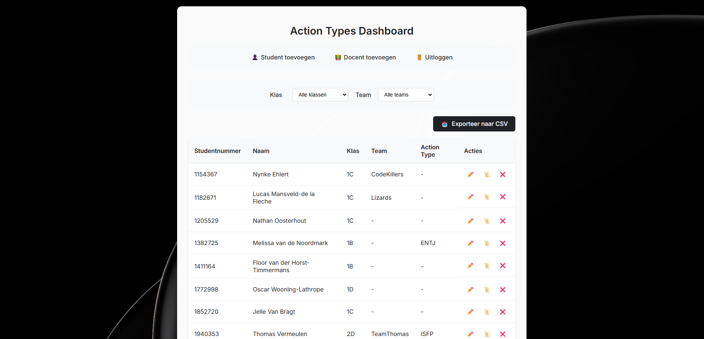
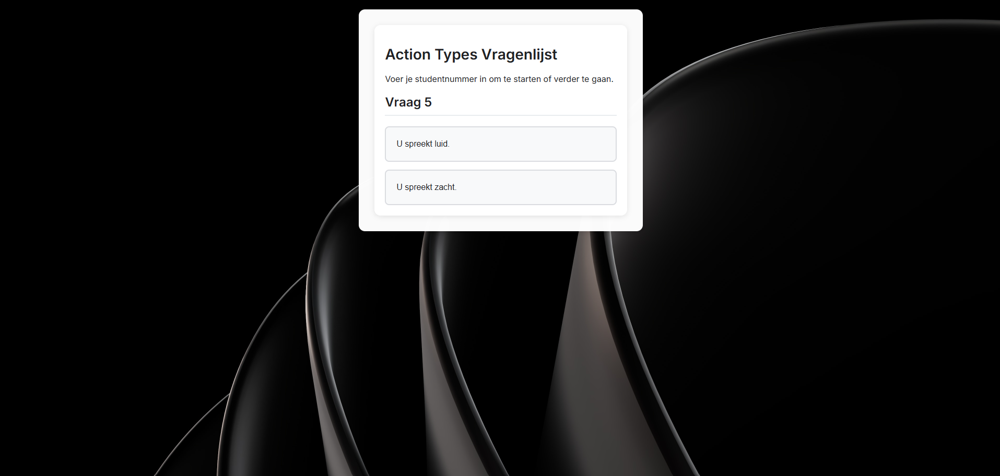

# 🚀 Action Types Applicatie

Deze webapplicatie is ontwikkeld voor WP3 en stelt studenten in staat om hun action type te bepalen door stellingen te beantwoorden. Daarnaast biedt de applicatie een beheerdersinterface voor docenten.

---

## 📌 Functionaliteiten

- ✅ **Studenten:**
  - Beantwoorden van stellingen om hun action type te bepalen.
  - Bekijken van hun persoonlijke resultaten.
- ✅ **Docenten:**
  - Beheer van studenten (toevoegen, bewerken, verwijderen).
  - Aanmaken en beheren van teams en het indelen van studenten.
  - Bekijken en exporteren van resultaten.
  - Toevoegen van andere docenten met beheerdersrechten.

---

## ⚙️ Installatie

### 📌 Vereisten
- **Python 3.11 of hoger**

### 📌 Stappenplan

1️⃣ **Clone de repository:**
```bash
git clone https://github.com/Rac-Software-Development/inhaal-wp3-actiontypes-thomas-1064763
cd inhaal-wp3-actiontypes-thomas-1064763
```

2️⃣ **Maak een virtuele omgeving aan en activeer deze:**
```bash
python -m venv venv
# Op Windows:
.\venv\Scripts\activate
# Op macOS/Linux:
source venv/bin/activate
```

3️⃣ **Installeer de benodigde dependencies:**
```bash
pip install -r requirements.txt
```

4️⃣ **Start de applicatie:**
```bash
python run.py
```

📌 **De applicatie is nu beschikbaar op:** `http://localhost:5000`

5️⃣ **Als admin inloggen:**
- **URL:** `http://localhost:5000/admin/login`
- **Gebruikersnaam:** `admin`
- **Wachtwoord:** `admin123`

---

## 📁 Structuur

De applicatie volgt een **MVC-architectuur**:
```
app/
├── controllers/    # Route handlers en businesslogica
├── models/         # Database modellen
├── static/         # CSS, JavaScript en afbeeldingen
├── templates/      # HTML templates
└── __init__.py     # Applicatieconfiguratie
```

---

## 🗄️ Database
De applicatie gebruikt **SQLite** en genereert automatisch de database bij het eerste gebruik. De belangrijkste tabellen zijn:

- **students** → Bevat studentgegevens.
- **statements** → Bevat de action type stellingen.
- **responses** → Opslag van antwoorden van studenten.
- **teachers** → Beheert docentaccounts en rechten.

---

## 🔒 Veiligheid
- **Wachtwoorden worden gehasht opgeslagen.**
- **Alleen ingelogde docenten** hebben toegang tot het beheerderspaneel.
- **Studenten kunnen alleen hun eigen resultaten zien.**

---

## 📸 Screenshots

Dashboard:


Vragenlijst:


---

## 📚 Gebruikte Libraries

- **Backend:** Flask, Flask-SQLAlchemy, Flask-WTF, SQLite
- **Frontend:** Jinja2, Bootstrap, JavaScript
- **Security:** Werkzeug (wachtwoord hashing)

---

## 📖 Bronnenlijst

- **Achtergrondafbeeldingen:** [https://4kwallpapers.com/](https://4kwallpapers.com/)
- **Fonts:** [https://fonts.google.com/](https://fonts.google.com/)


